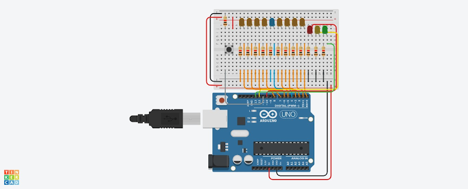
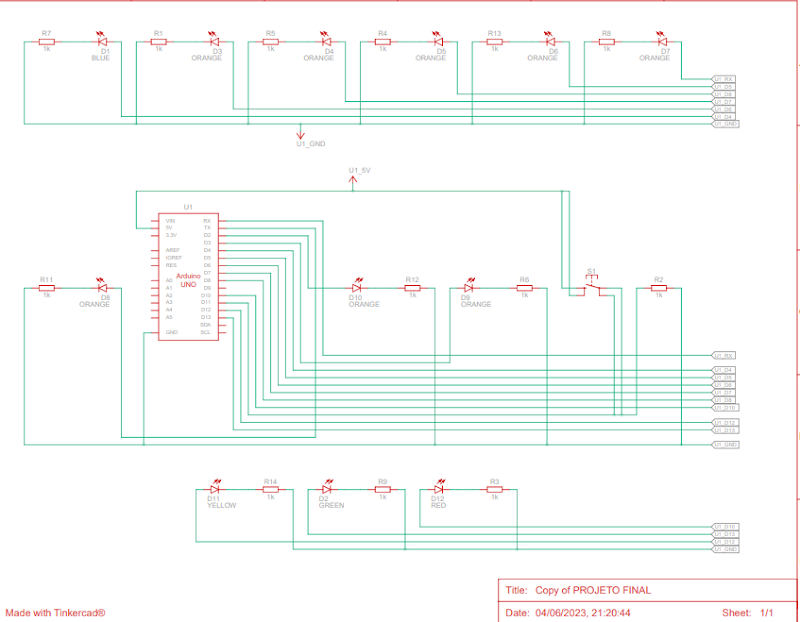

# TargetLed
Projeto realizado dentro da cadeira de Introdução a Robótica, simulando um jogo de alvo.

# objetivo
O objetivo do jogo TARGETLED é responder rapidamente aos estímulos luminosos apresentados pelos LEDs. Os jogadores devem demonstrar reflexos rápidos, atenção e habilidades de tomada de decisão em tempo real.

# Regras
1. Os jogadores ganham pontos ao clicar corretamente acertando a cor do LED azul.

2. O jogo pode ser dividido em níveis, onde cada nível representa um aumento na dificuldade.

# Especificações
Foram utilizados digitalmente, no tinkercad:
-Arduino Uno R3
-1,"Azul LED"
-14 Resistores de 1 kΩ
-1,Botão
-8 LEDs Laranja LED
-1 LED verde
-1 LED amarelo
-1 LED vermelho

# Ferramenta Utilizada
-Arduino UNO/C++

